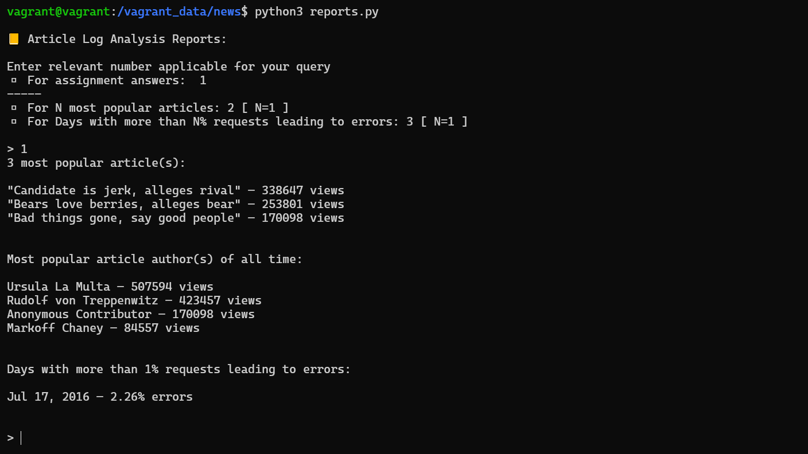

# Project: Logs Analysis

## RUN command
```py
python3 reports.py
```

### VIEWs used:

##### ARTICLES_BY_POPULARITY:
```sql
CREATE VIEW v_articles_by_popularity AS
SELECT
  a.title,
  l.access_count
FROM
  articles a
  INNER JOIN (
    SELECT
      path,
      count(*) AS access_count
    FROM
      log
    GROUP BY
      path
  ) AS l ON CONCAT('/article/', a.slug) = l.path
ORDER BY
  l.access_count DESC;
```
##### ARTICLES_ACCESS_COUNT:
```sql
CREATE VIEW v_article_access_count AS
SELECT
  path,
  count(*) AS access_count
FROM
  log
GROUP BY
  path;
```
##### ARTICLE_AUTHORS:
```sql
CREATE VIEW v_article_authors AS
SELECT
  au.id,
  au.name,
  ar.slug
FROM
  authors au
  INNER JOIN articles ar ON au.id = ar.author
ORDER BY
  au.id;
```
##### ERROR_DETAILS_BY_DATE
```sql
CREATE VIEW v_error_details_by_date AS
SELECT
  a.date,
  a.error_count,
  b.total_count
FROM
  (
    SELECT
      DATE(time) AS date,
      count(*) AS error_count
    FROM
      log
    WHERE
      status != '200 OK'
    GROUP BY
      DATE(time)
  ) a
  INNER JOIN (
    SELECT
      DATE(time) AS date,
      count(*) AS total_count
    FROM
      log
    GROUP BY
      DATE(time)
  ) b ON a.date = b.date;
```
### Program Output:

